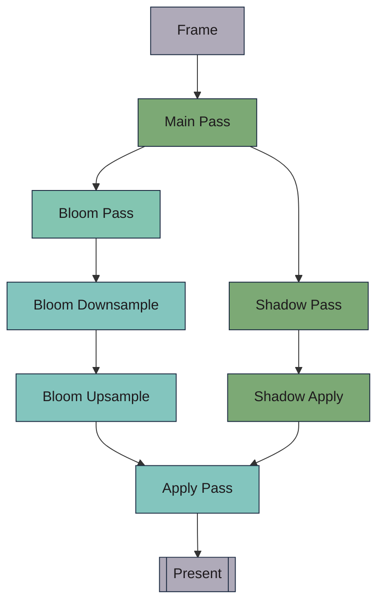

# Circulli Bellum 

<!-- simply  does not work -->

https://github.com/user-attachments/assets/e60a025d-6315-42ad-a20d-7989150d5440

**Circulli Bellum** is my clone of the game **"ROUNDS"**, but *somewhat* from scratch. The game uses [Box2D](https://github.com/erincatto/box2d) for physics and Vulkan for graphics (via [Lum-al](https://github.com/platonvin/lum-al))

Everything is drawn as a basic shape to use power of SDF's for "software" antalisaing (like MSAA but better)\
To enhance viusals, there is bloom effect, separate shadow pass, and some simple chromatic aberration.

It’s not super optimized on the GPU-side (for that, check out my other project [Lum](https://github.com/platonvin/lum) ), but still runs pretty well

All entities are stored in double-linked lists with only one pointer dereference and accessed by physics engine via curtom RTTI system (i prefer custom RTTI over standard C++ inheritance + override).\
At some point new(malloc) became a bottlneck but it was crutch-fixed with arena allocator.\
Currently, game suffers from giant structures accessed randomly (aka no cache coherence), but this will not be fixed. 
ECS (aka SoA) is what solves all these problems, but whole point was to learn how games are made commonly

